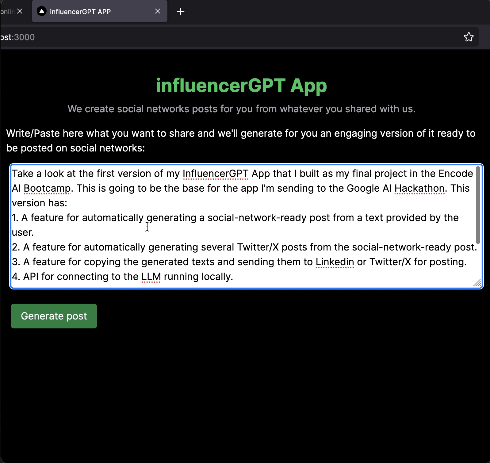
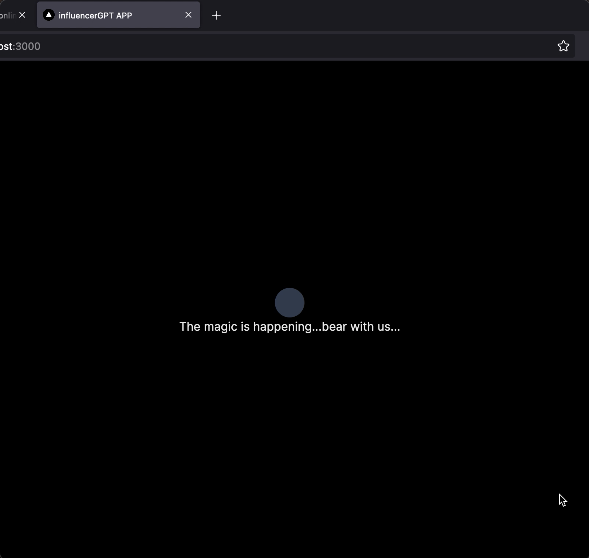
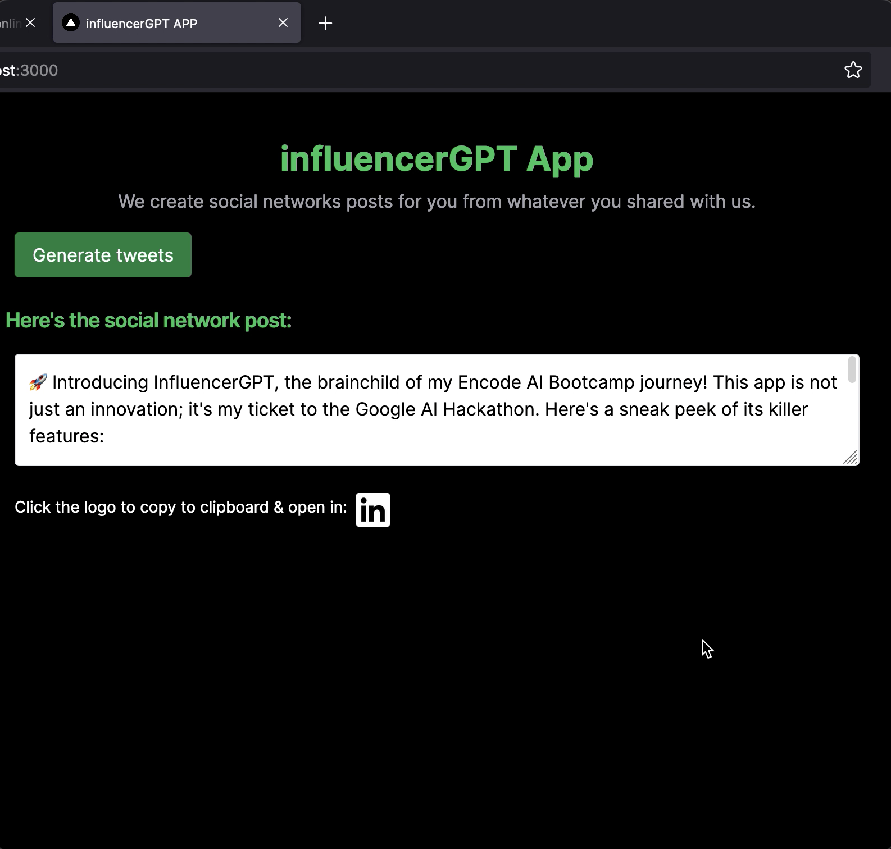
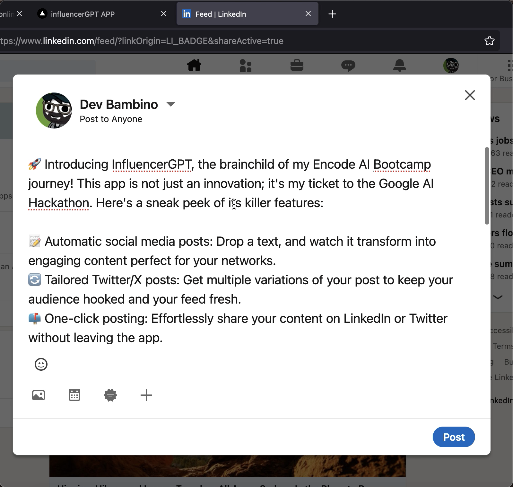
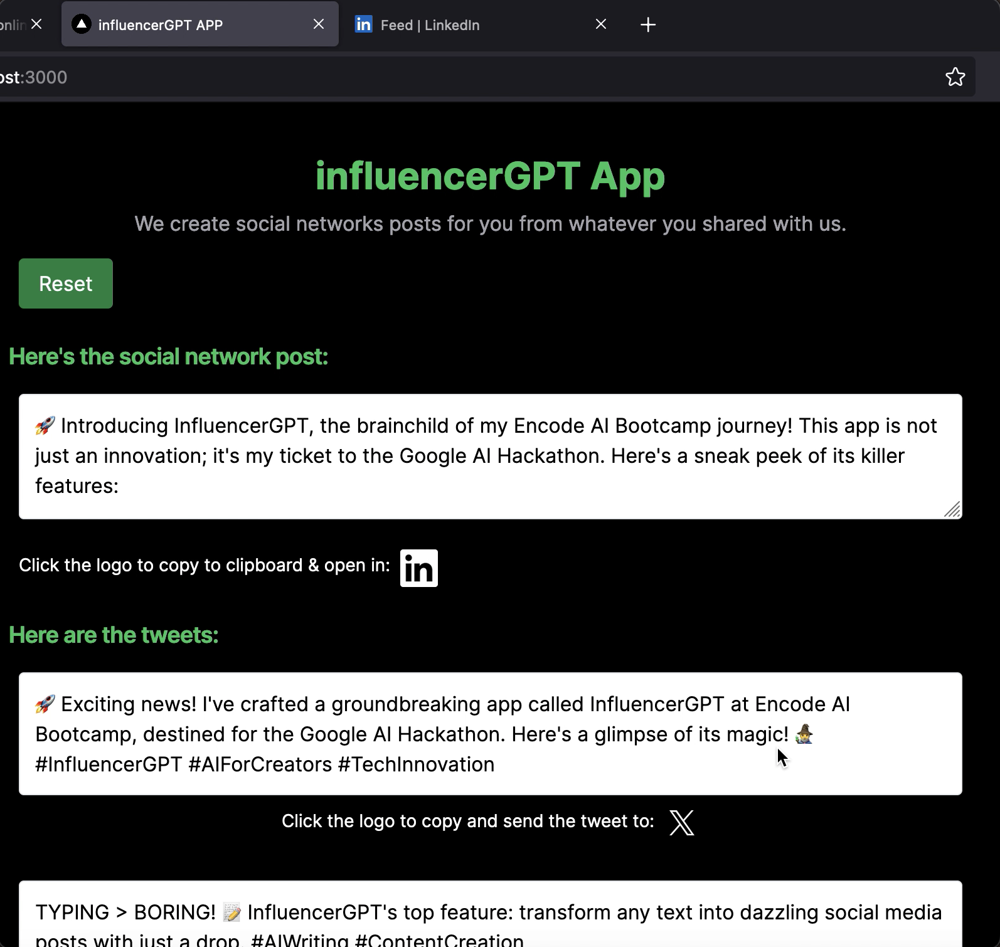
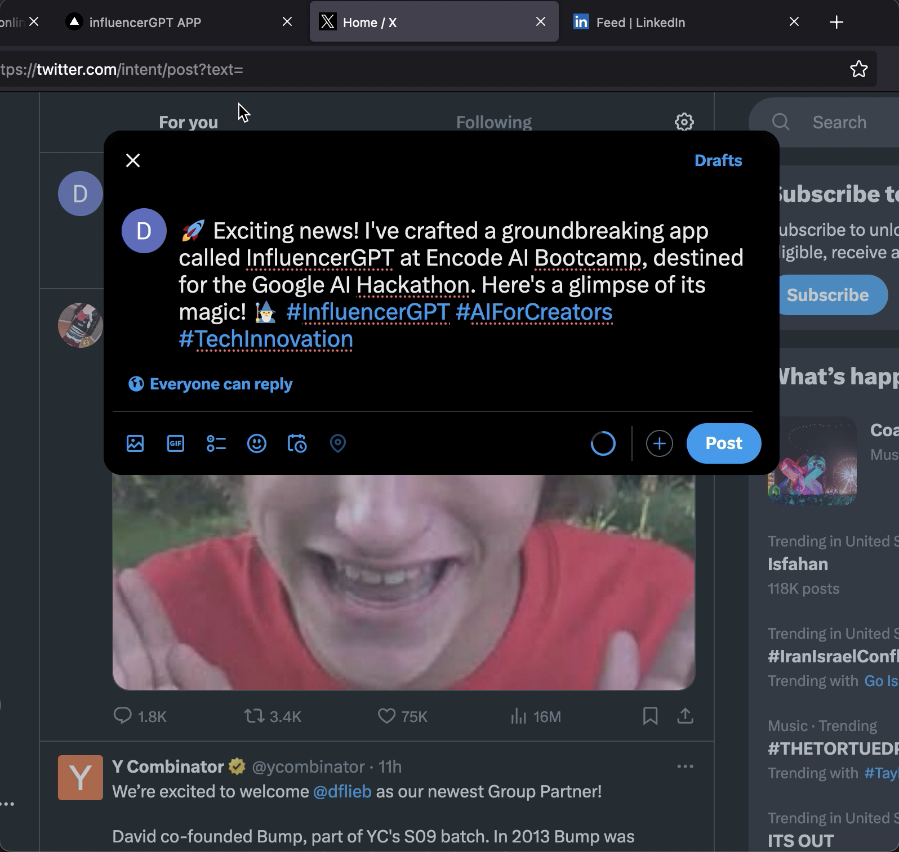

# InfluencerGPT v1
🚀 Introducing InfluencerGPT, the AI sidekick for social media mavens! This innovative app is primed to revolutionize the content creation workflow. Created for the Google AI Hackathon.

## Features
Here's what you get:

- 📝 **Automatic Post Generation**: Type in your core message and watch as the app transforms it into captivating social media content.

- 🔄 **Multi-Platform Post Customization**: With customized versions for Linkedin, Facebook and Instagram. You also get varied Twitter/X post versions from the initial post, optimized for the platform.

- 🌍 **One-Click Posting**: Effortlessly send your polished posts to LinkedIn or Twitter with a single click.

- 🔍 **Gemini Pro 1.5 Integration**: Connect with the powerful Gemini Pro 1.5 language model for personalized text generation using the Google AI's API.

- 🎉 **User-Friendly Interface**: Enjoy a responsive web app experience with a sleek, modern design by tailwindCSS.

## Screenshots

### The home screen

### Processing screen

### Generated post for Linkedin

### Easy and quick share to Linkedin

### Generated posts for Twitter

### Easy and quick share to Twitter

## Tech behind

This app is connecting locally to a LLM using the text-gen-webui API.