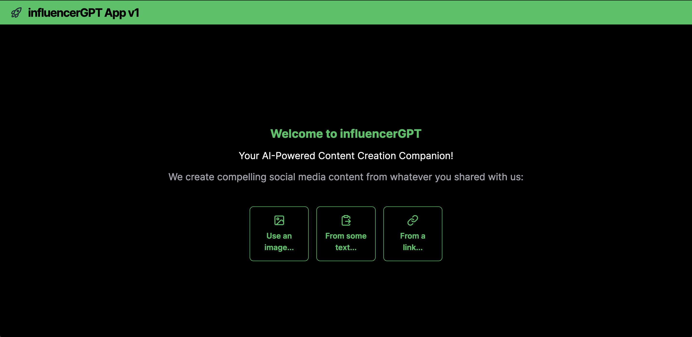
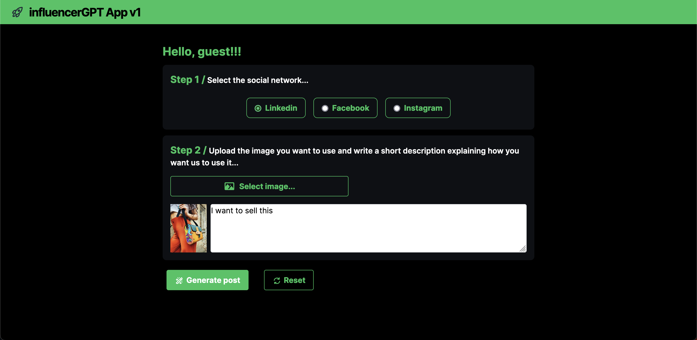
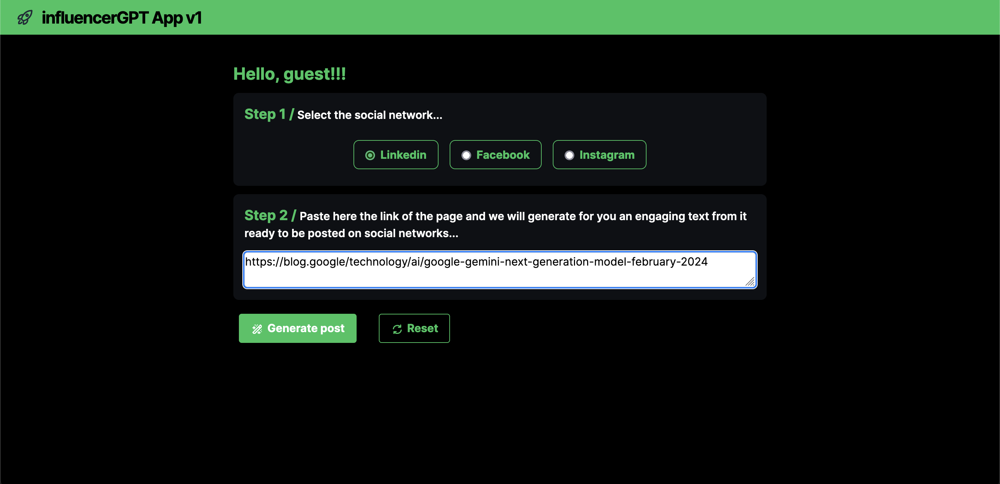
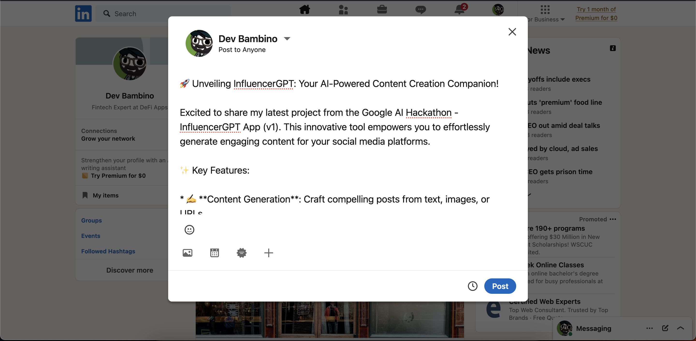
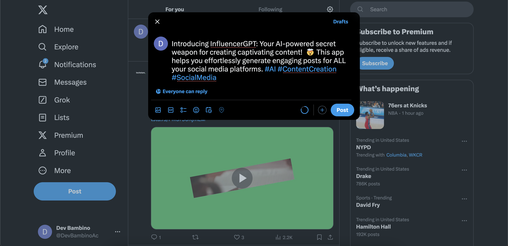
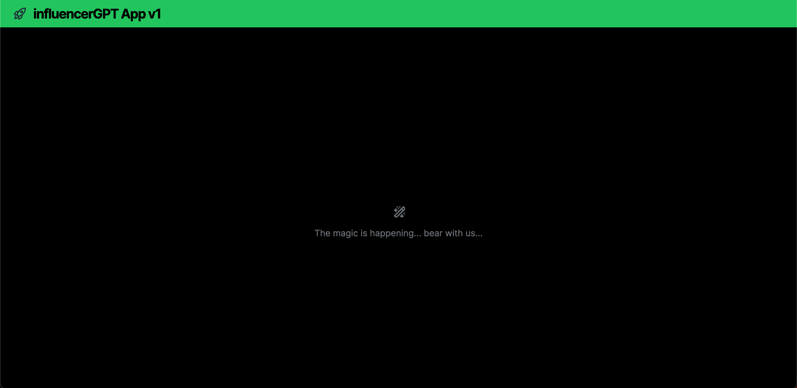

# InfluencerGPT v1
🚀 Unveiling InfluencerGPT: Your AI-Powered Content Creation Companion! 
This innovative app is designed to streamline the social media presence of businesses and individuals by transforming text, images, or URLs into engaging posts. 🤯

## Features
Here's what it offers:

- 🪄 **Automated Post Generation:** Craft compelling social media content from various inputs, saving you time and effort. 

- ✂️ **Twitter Thread Creation:** Seamlessly convert your post into a captivating Twitter thread for maximum engagement.

- 📲 **Effortless Sharing:** Share your generated content directly to LinkedIn, Facebook, Instagram, or Twitter/X with a single click. 

- 🧠 **Powered by Gemini Pro:** Leverages advanced AI capabilities for top-notch content quality.

- 💻 **Responsive Design:** Enjoy a user-friendly experience across all devices. 

## How to use it

### Install all the dependencies
`npm install`

### Create .env in root
Include your Google Gemini API key there with the variable name: 
`GOOGLE_API_KEY="your_key_here"`

### Run the app
`npm run dev`

## Troubleshooting

The feature generating a post from an url is doing web scraping to extract the text from the web page shared. If you are running the app in Localhost then a Cross-Origin Resource Sharing (CORS) issue would occur. To fix the issue you would need to use the Firefox web browser and install the extension [CORS Everywhere](https://addons.mozilla.org/en-US/firefox/addon/cors-everywhere/).

## Tech behind

This app is using Google AI API for connecting to Gemini Pro 1.5 LLM.

## Copyrights

All copyrights reserved to Dev Bambino user, 2024. The commercial use of the code provided in this repository is forbidden without express authorization.